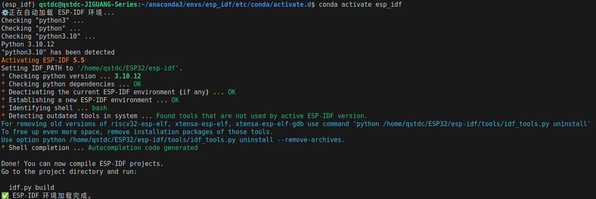

ESP32开发小智教程
===

---
- [ESP32开发小智教程](#esp32开发小智教程)
  - [前言开发环境要求](#前言开发环境要求)
  - [1. 安装准备](#1-安装准备)
    - [1.1 Python 版本](#11-python-版本)
    - [1.2 Cmake 版本](#12-cmake-版本)
  - [2. 获取 ESP-IDF](#2-获取-esp-idf)
  - [3. 设置工具](#3-设置工具)
  - [4. 设置环境变量](#4-设置环境变量)
    - [4.1. 临时设置环境变量](#41-临时设置环境变量)
    - [4.2. 创建别名以简化操作（非conda环境的方法）](#42-创建别名以简化操作非conda环境的方法)
    - [4.3. 自动导入的方法（conda环境的方法）](#43-自动导入的方法conda环境的方法)
  - [5. 创建HelloWord测试工程](#5-创建helloword测试工程)
    - [5.1. 准备工作](#51-准备工作)
    - [5.2. 编译工程](#52-编译工程)
    - [5.3. 小技巧](#53-小技巧)
  - [6. 创建小智AI工程](#6-创建小智ai工程)
    - [6.1. 下载源码](#61-下载源码)
    - [6.2. 配置环境](#62-配置环境)
    - [6.3. 更换编译板子类型](#63-更换编译板子类型)
    - [6.4. 唤醒词和AEC实时打断](#64-唤醒词和aec实时打断)
    - [6.5. 配置你的第一个GPIO](#65-配置你的第一个gpio)
  - [FQA](#fqa)

---

##  前言开发环境要求

- **系统版本：** Ubuntu 22.04
- **ESP-IDF：** 5.5
- **环境：** conda

-----

## 1\. 安装准备

编译 ESP-IDF 需要以下软件包支持，输入指令进行安装：

```bash
sudo apt-get install git wget flex bison gperf python3 python3-venv python3-setuptools cmake ninja-build ccache libffi-dev libssl-dev dfu-util libusb-1.0-0
```

以上软件包安装成功以后，我们还需要确定两个软件包的版本是否满足 ESP-IDF 的需求。

### 1.1 Python 版本

目前，ESP-IDF 4.3 以上的版本都是基于 python3 进行构建。输入指令查看：

```bash
python3 --version
```

当输出 `Python 3.x.x` 时，`python3` 软件包安装成功。

本项目使用的是`Python 3.7.12`，同时还是在**conda**环境中创建的IDF开发环境，如果需要创建环境，可以参考下列指令：
```bash
conda create -n esp_idf python=3.7
```
然后输入进入该环境进行后续操作。

### 1.2 Cmake 版本

使用 ESP-IDF (5.5) 需要 CMake 3.16 或以上版本，输入指令查看：

```bash
cmake --version
```

当输出 `cmake version 3.x.x` （高于 3.16）时，`camke` 软件包安装成功。

-----

## 2\. 获取 ESP-IDF

在围绕 ESP32 构建应用程序之前，需要先获取乐鑫提供的软件库文件 [ESP-IDF](https://github.com/espressif/esp-idf?spm=a2c6h.12873639.article-detail.7.4e08259bp3fOLD) 仓库。

获取 ESP-IDF 的本地副本：打开终端，切换到要保存 ESP-IDF 的工作目录，使用 `git clone` 命令克隆远程仓库。

打开终端，输入以下命令：

```bash
mkdir -p ~/esp && cd ~/esp
git clone --recursive https://github.com/espressif/esp-idf.git
```

ESP-IDF 将下载至 `~/esp/esp-idf`。

-----

## 3\. 设置工具

除了 ESP-IDF 本身，还需要为支持 ESP32 的项目安装 ESP-IDF 使用的各种工具，比如编译器、调试器、Python 包等。

ESP32 官方为我们提供了安装脚本 `install.sh`。为了加快下载速度，我们优先选择 Espressif 的下载服务器。

仅为 ESP32 安装所需工具（这里使用的是esp32s3）：

```bash
cd ~/esp/esp-idf
export IDF_GITHUB_ASSETS="dl.espressif.com/github_assets"
./install.sh esp32s3
```

为多个目标芯片安装工具（例如 esp32 和 esp32s2）：
```bash
./install.sh esp32,esp32s2
```
为所有支持的目标芯片安装工具：

```bash
./install.sh all
```

-----

## 4\. 设置环境变量

此时，刚刚安装的工具尚未添加至 PATH 环境变量。因此，必须设置一些环境变量。

### 4.1\. 临时设置环境变量

在需要运行 ESP-IDF 的终端窗口运行以下命令：

```bash
. $HOME/esp/esp-idf/export.sh
```
也可以在`esp-idf`的更目录下执行：
```bash
. ./export.sh
```


### 4.2\. 创建别名以简化操作（非conda环境的方法）

每次获取 esp-idf 环境都需要输入一大段命令比较麻烦。我们可以为执行 `export.sh` 创建一个别名，具体步骤如下：

**(1) 使用 gedit 打开 .bashrc 配置文件：**

```bash
sudo gedit ~/.bashrc
```

**(2) 复制并粘贴以下命令到 .bashrc 配置文件中：**

```bash
alias get_idf='. $HOME/esp/esp-idf/export.sh'
```

粘贴完成后，使用 `CTRL+S` 快捷键保存内容，然后关闭文档。

**(3) 输入指令，刷新配置环境并重启系统：**

```bash
source ~/.bashrc
```

这样我们可以在任何终端窗口中运行 `get_idf` 来设置或刷新 esp-idf 环境。

### 4.3\. 自动导入的方法（conda环境的方法）
首先找到你的conda环境所在的目录，并且创建相关的激活脚本文件夹并进入
```bash
mkdir -p ~/anaconda3/envs/esp_idf/etc/conda/activate.d && cd ~/anaconda3/envs/esp_idf/etc/conda/activate.d
```
>其中`anaconda3`可以换成`miniconda3`，取决于你安装的conda版本

```bash
cat << 'EOF' > "esp-idf-setup.sh"
#!/bin/bash
# 自动加载 ESP-IDF 环境
echo "⚙️ 正在自动加载 ESP-IDF 环境..."
# 确保路经正确
source "$HOME/esp/esp-idf/export.sh"
echo "✅ ESP-IDF 环境加载完成。"
EOF
```
赋予权限：
```bash
chmod +x esp-idf-setup.sh
```

然后重新进入 esp_idf 环境
```bash
conda activate esp_idf
```

正确输出如下：



-----

## 5\. 创建HelloWord测试工程

### 5.1\. 准备工作

我们可以从 ESP-IDF 中 `examples` 目录下的 `get-started/hello_world` 工程开始。

将 `get-started/hello_world` 工程复制至本地的 `~/esp` 目录下：

```bash
cd ~/esp
cp -r $IDF_PATH/examples/get-started/hello_world .
```
然后连接设备，将 ESP32 开发板连接到 PC ，输入指令查看开发板使用的串口。

```bash
sudo ls /dev/tty*
```

一般设备名称的最后一个，就是 ESP32 开发板在虚拟机上映射的串口名称（如 `ttyUSB0` 或者 `ttyACM0`）。记住该串口名，后续烧录和监控中需要使用。

配置工程

进入 `hello_world` 目录，设置 ESP32 为目标芯片，然后运行工程配置工具 `menuconfig`。

```bash
cd ~/esp/hello_world
idf.py set-target esp32s3
idf.py menuconfig
```

>[\!NOTE]
>打开一个新工程后，应首先使用 `idf.py set-target esp32` 设置“目标”芯片。此操作将清除并初始化项目之前的编译和配置（如有）。`hello_world` 示例项目可以使用默认配置运行，因此在这一项目中，可以跳过使用 `menuconfig` 进行项目配置。

### 5.2\. 编译工程

使用以下指令，编译工程：
```bash
idf.py build
```
运行以上指令可以编译应用程序和所有 ESP-IDF 组件，接着生成引导加载程序(`bootloader.bin`)、分区表(`partition-table.bin`)和应用程序二进制文件(`xxxx.bin`),如果一切正常，编译完成后将生成 .bin 文件。

运行以下指令，将刚刚生成的二进制文件烧录至 ESP32 开发板：
```bash
idf.py -p /dev/ttyUSB0 flash
```
如果一切顺利，烧录完成后，开发板将会复位，应用程序 **“hello_world”** 开始运行，也可以使用 `idf.py -p PORT monitor` 命令，监视 **“hello_world”** 工程的运行情况。
```bash
idf.py -p /dev/ttyUSB0 monitor
```
>`Ctrl + ] `退出监视器程序
>更详细的操作方法查看[IDF监视器文档](https://docs.espressif.com/projects/esp-idf/zh_CN/stable/esp32/api-guides/tools/idf-monitor.html)

也可以用下面的指令完成编译、烧录和监视：
```bash
idf.py build flash monitor
```

>[\!NOTE]
>当我们需要清除刚刚编译和配置的文件时（或者我们运行出问题需要重新编译），ESP-IDF 提供了两种清除指令。 
> - ```idf.py clean ```
>可以使用 ```idf.py clean``` 命令从生成目录中删除项目生成输出文件。
>该项目将在下次构建时被完全重建。使用这个方法并不会删除构建文件夹中的 CMake 配置输出。
>
> - ``` idf.py fullclean ```
>运行此命令将删除整个 **"build"** 目录的内容。这包括所有的 CMake 配置输出。下次构建项目时，CMake 将从头开始配置它。注意，这个选项会递归地删除构建目录中的所有文件，所以要小心使用。项目配置不会被删除。

### 5.3\. 小技巧

如果嫌下载速度慢，可以运行以下命令，增加-b参数 后面就是下载的波特率
```bash
idf.py -b 2000000 build flash monitor
```
>[\!NOTE]
>如果下载失败，可以尝试降低波特率，或者不指定波特率，直接执行`flash`

如果不想所有分区都下载一遍，就运行以下命令，就只会下载app分区
```bash
idf.py build app-flash monitor
```
如果想要合并生成的bin为一个bin文件，就运行
```bash
idf.py merge-bin 
```
会生成一个`merged-binary.bin`文件在`build`文件夹，使用该文件就可以给别的设备一次下载完整固件
当使用不同型号的芯片时，以下为设置芯片的命令示例：
 `idf.py set-target esp32`       设置目标芯片为esp32
 `idf.py set-target esp32s2`       设置目标芯片为esp32s2
 `idf.py set-target esp32s3`       设置目标芯片为esp32s3
 `idf.py set-target esp32c3`       设置目标芯片为esp32c3
 `idf.py set-target esp32p4`       设置目标芯片为esp32p4


>[\!NOTE]
>把一个工程转移到别的路径时需要删除build文件夹
>不要把工程放到中文目录路径下！
>养成良好的删除build文件夹的习惯！能解决各种小问题


>[\!NOTE]
>这是因为 ESP32-S3 使用原生 USB (USB-OTG/JTAG) 作为串口时，自动复位电路有时会失效，或者之前的固件导致 USB 状态异常。
>请尝试手动进入下载模式，步骤如下：
> 1. 按住板子上的 BOOT 按钮（通常标有 BOOT 或 0）不放。
> 2. 按一下然后松开 RESET 按钮（通常标有 RST 或 EN）。
> 3. 松开 BOOT 按钮
> 
>此时，再次运行烧录命令,


如果成功运行，则可以进行接下来的进阶操作

## 6\. 创建小智AI工程

### 6.1\. 下载源码

进入[小智](https://github.com/78/xiaozhi-esp32)项目页面，可以查看相关项目详解。

在`~/esp/`目录下`git`项目
```bash
git clone https://github.com/78/xiaozhi-esp32.git
```

### 6.2\. 配置环境
进入自己创建的`esp_idf`环境
```bash
conda activate esp_idf
```

>[\!NOTE]
>
>

进入到目录后，默认的编译芯片是ESP32的，所以自己的板子是S3的话一定要输入以下命令把芯片设置为S3
```bash
idf.py set-target esp32s3
```

### 6.3\. 更换编译板子类型

默认编译出的固件是面包板的，如果需要更换板子，需要输入
```bash
idf.py menuconfig
```
进入**Xiaozhi Assistant**选项


选Board Type进去选择自己的board类型


选择需要编译的板子固件后按键盘的‘S’键保存 然后**Esc**退出**menuconfig**

再次输入`idf.py build`进行编译，或者输入`idf.py build flash monitor`进行下载和显示日志

### 6.4\. 唤醒词和AEC实时打断

1. 打开AEC实时打断功能
  在`idf.py menuconfig`的界面进入**Xiaozhi Assistant**然后勾选**Enable Server-Side AEC (Unstable)**
  
  

2. 修改唤醒词
  选择**Wake Word Implementation Type**改成第三个，在**Custom Wake Word**中输入自己想要的任意唤醒词的拼音，需要有空格隔开，我输入的是小晴小晴的拼音.

  

  设置**Speech**

  

### 6.5\. 配置你的第一个GPIO

具体教程可以查看[小智官方的文档](https://kcn80f4hacgs.feishu.cn/docx/J2MrdqW27oybcCxu7Sfc4gBcn4g)

下面是开发板的引脚配置图：


更多内容可以查询[ESP32S3开发板](https://docs.espressif.com/projects/esp-dev-kits/zh_CN/latest/esp32s3/esp32-s3-devkitc-1/user_guide_v1.1.html#id11)


---
[FQA](/Embedded_Development/ESP32/docs/FAQ.md)
---