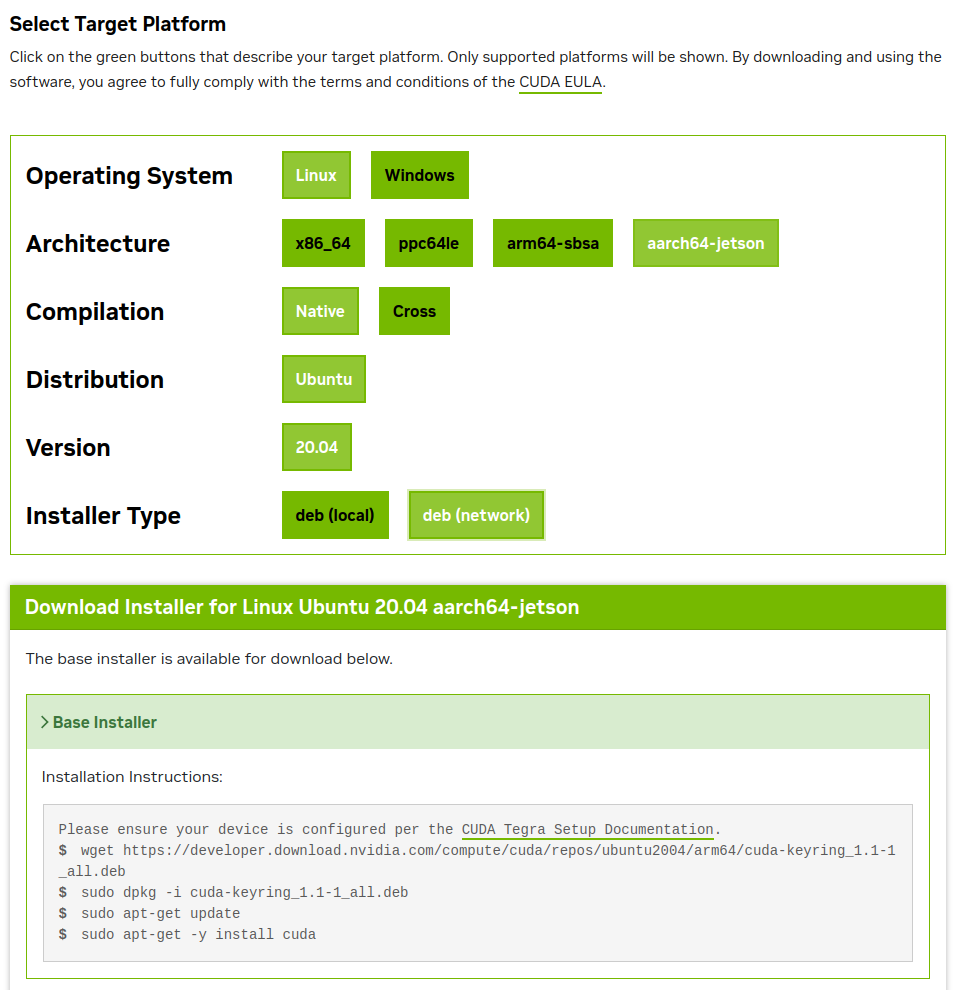

CUDA 版本管理
===
---
- [CUDA 版本管理](#cuda-版本管理)
  - [0. cuda版本确认](#0-cuda版本确认)
  - [1. 环境确认以及CUDA下载](#1-环境确认以及cuda下载)
  - [2. 系统级CUDA安装管理](#2-系统级cuda安装管理)
  - [3. 自动化环境配置脚本](#3-自动化环境配置脚本)
  - [4. GCC/G++版本环境配置（可选）](#4-gccg版本环境配置可选)
  - [5. 使用示例](#5-使用示例)
  - [6. 添加boot权限（可选）](#6-添加boot权限可选)
  - [7. Jetson平台的CUDA安装（进阶）](#7-jetson平台的cuda安装进阶)
---

## 0. cuda版本确认
查看系统安装的 CUDA 路径（确认是否存在）,
如果已安装，通常会在 `/usr/local/` 目录下有对应的文件夹：
```bash
ls -l /usr/local | grep cuda
```
```bash
ls -l /usr/local | grep cuda
lrwxrwxrwx  1 root root   22 11月 17 10:32 cuda -> /etc/alternatives/cuda
drwxr-xr-x 17 root root 4096 11月  5 17:44 cuda-11.8
drwxr-xr-x 17 root root 4096 11月  5 17:39 cuda-12.4
drwxr-xr-x 17 root root 4096 11月 17 10:31 cuda-12.6
drwxr-xr-x 17 root root 4096 11月  6 11:06 cuda-13.0
```

## 1. 环境确认以及CUDA下载
确保nvidia驱动已经正确安装，使用`nvidia-smi`确认（最高支持的cuda版本也可以确认），如果没有安装请跳转[Nvidia驱动安装](nvidia_drive.md)文档进行安装

选择合适的版本进行下载 [*CUDA Toolkit Archive*](https://developer.nvidia.com/cuda-toolkit-archive)
>**注意：**
>对于**Jetson Orin NX**平台，请转到<a href="#Jetson">**Jetson 设备**</a>的安装方法

这里选择 **runfile（local）** 方式进行下载，如图以**cuda13.0**为例
```bash
wget https://developer.download.nvidia.com/compute/cuda/13.0.1/local_installers/cuda_13.0.1_580.82.07_linux.run
```


下载之后到指定文件夹后进行安装，具体安装参考<a href="#lable">**系统级CUDA安装管理**</a>

>如果不知道自己系统是什么版本和架构，可以输入下面指令查看：
>```bash
>lsb_release -a
>```
>或者
>```bash
>hostnamectl
>```


<span id="lable"></span>

## 2. 系统级CUDA安装管理
以**11.8**和**12.4**为例（注意包名和cu的是否对得上）
>例如我下载的包名为**cuda_11.8.0_520.61.05_linux.run**,那么我执行指令为
>```bash
>sudo sh cuda_11.8.0_520.61.05_linux.run --toolkit --silent --override --toolkitpath=/usr/local/cuda-11.8
>```
>后面**cuda-11.8**需要对应包的版本
```bash
# 安装多个CUDA版本到系统目录
sudo sh cuda_11.8.0_520.61.05_linux.run --toolkit --silent --override --toolkitpath=/usr/local/cuda-11.8
sudo sh cuda_12.4.0_550.54.15_linux.run --toolkit --silent --override --toolkitpath=/usr/local/cuda-12.4

# 注册到update-alternatives
sudo update-alternatives --install /usr/local/cuda cuda /usr/local/cuda-11.8 118
sudo update-alternatives --install /usr/local/cuda cuda /usr/local/cuda-12.4 124
```
```bash
# 设置默认版本（可选）
sudo update-alternatives --set cuda /usr/local/cuda-12.4
```


## 3. 自动化环境配置脚本

创建通用的配置函数：

```bash
# 为vm1reocn环境创建配置
mkdir -p ~/anaconda3/envs/vm1reocn/etc/conda/activate.d
mkdir -p ~/anaconda3/envs/vm1reocn/etc/conda/deactivate.d
```
>**注意：**
>其中`vm1reocn`修改为自己的环境名称

激活脚本：
```bash
cat > ~/anaconda3/envs/vm1reocn/etc/conda/activate.d/cuda_hook.sh << 'EOF'
#!/bin/bash
echo "激活 CUDA 11.8 环境"

# 设置CUDA相关环境变量
export CUDA_HOME=/usr/local/cuda-11.8
export PATH=${CUDA_HOME}/bin:${PATH}
export LD_LIBRARY_PATH=${CUDA_HOME}/lib64:${LD_LIBRARY_PATH}

# 设置GCC版本
export CC=/usr/bin/gcc-9
export CXX=/usr/bin/g++-9

# 可选：备份当前设置（用于恢复）
export OLD_CUDA_HOME=${CUDA_HOME:-}
export OLD_PATH=${PATH}
export OLD_LD_LIBRARY_PATH=${LD_LIBRARY_PATH}
export OLD_CC=${CC:-}
export OLD_CXX=${CXX:-}
EOF
```
退出脚本：
```bash
cat > ~/anaconda3/envs/vm1reocn/etc/conda/deactivate.d/cuda_hook.sh << 'EOF'
#!/bin/bash
echo "退出 CUDA 11.8 环境"

# 恢复环境变量
if [ -n "${OLD_CUDA_HOME}" ]; then
    export CUDA_HOME=${OLD_CUDA_HOME}
else
    unset CUDA_HOME
fi

export PATH=${OLD_PATH}
export LD_LIBRARY_PATH=${OLD_LD_LIBRARY_PATH}

if [ -n "${OLD_CC}" ]; then
    export CC=${OLD_CC}
else
    unset CC
fi

if [ -n "${OLD_CXX}" ]; then
    export CXX=${OLD_CXX}
else
    unset CXX
fi

# 清理备份变量
unset OLD_CUDA_HOME OLD_PATH OLD_LD_LIBRARY_PATH OLD_CC OLD_CXX
EOF
```
赋予权限
```bash
chmod +x ~/anaconda3/envs/vm1reocn/etc/conda/activate.d/cuda_hook.sh
chmod +x ~/anaconda3/envs/vm1reocn/etc/conda/deactivate.d/cuda_hook.sh
```

## 4. GCC/G++版本环境配置（可选）

```bash
# 安装必要的GCC版本
sudo apt update
sudo apt install gcc-9 g++-9 gcc-10 g++-10 gcc-11 g++-11

# 注册GCC到update-alternatives
sudo update-alternatives --install /usr/bin/gcc gcc /usr/bin/gcc-9 9
sudo update-alternatives --install /usr/bin/gcc gcc /usr/bin/gcc-10 10
sudo update-alternatives --install /usr/bin/gcc gcc /usr/bin/gcc-11 11
sudo update-alternatives --install /usr/bin/g++ g++ /usr/bin/g++-9 9
sudo update-alternatives --install /usr/bin/g++ g++ /usr/bin/g++-10 10
sudo update-alternatives --install /usr/bin/g++ g++ /usr/bin/g++-11 11
```


## 5. 使用示例
激活环境并验证：
```bash
conda activate vm1reocn
```
查看安装的CUDA版本：
```bash
nvcc -V
```


## 6. 添加boot权限（可选）

**使用环境变量而非sudo**（避免密码输入）：
```bash
# 在激活脚本中使用软链接而非update-alternatives
ln -sf /usr/local/cuda-$cuda_version $CONDA_PREFIX/etc/conda/activate.d/cuda
export PATH=$CONDA_PREFIX/etc/conda/activate.d/cuda/bin:$PATH
```

**创建管理工具脚本** `cuda_manager.sh`（可选）：
```bash
#!/bin/bash
list_cuda_versions() {
    echo "已安装的CUDA版本:"
    ls -d /usr/local/cuda-* 2>/dev/null
}

switch_global_cuda() {
    sudo update-alternatives --config cuda
}
```


<span id="Jetson"></span>

## 7. Jetson平台的CUDA安装（进阶）
先查看NVIDIA JetPack 版本
```bash
cat /etc/nv_tegra_release
```
示例输出解释：
```
# R35 (release), REVISION: 3.1, GCID: 32827747, BOARD: t186ref, EABI: aarch64, DATE: Sun Mar 19 15:19:21 UTC 2023
```
在这个例子中：
- R35.4.1 是 L4T 版本。
- 您需要拿着 L4T R35.4.1 这个版本号去 [NVIDIA JetPack 归档](https://developer.nvidia.com/embedded/jetpack-archive) 页面查询，它对应的是哪个具体的 JetPack SDK 版本.

由于我的Jetson Orin NX 上安装的 L4T 版本是 R35.3.1，根据 NVIDIA 官方的 JetPack 归档信息，L4T R35.3.1 对应的 NVIDIA JetPack SDK 版本是：**JetPack 5.1.1**

每个 CUDA 版本仅支持特定 NVIDIA JetPack 版本的升级。下表显示了每个 CUDA 版本支持的 NVIDIA JetPack SDK 版本。
| JetPack 版本系列 | CUDA 11.4 | CUDA 11.8 | CUDA 12.0 | CUDA 12.1 | CUDA 12.2 | CUDA 12.3 | CUDA 12.4 及更高 |
| :--- | :--- | :--- | :--- | :--- | :--- | :--- | :--- |
| **JetPack 5.x** (基于 L4T R35.x) | **默认** | C | C | C | C | X | 不兼容 (X) |
| **JetPack 6.x** (基于 L4T R36.x) | 不适用 | 不适用 | 不适用 | 不适用 | **默认** | X | C |

**图表说明：**
*   **默认**：该 CUDA 版本为对应 JetPack SDK 的原生默认版本。
*   **C**：**兼容**。通常指该版本的 CUDA Toolkit 可以在该 JetPack 环境中安装和运行。
*   **X**：**不兼容**。通常指该版本的 CUDA Toolkit 无法在此 JetPack 环境中正常运行。
*   **不适用**：通常因版本跨度较大，不在主要支持范围内。
*   **JetPack 5.x**：主要支持 CUDA 11.x，并向后兼容部分 CUDA 12.x。
*   **JetPack 6.x**：主要支持更新的 CUDA 12.x 分支，上表仅覆盖部分版本，通常对后续 12.x 版本也保持兼容。**（不支持12.7版本）**


>**注意：**
>- NVIDIA JetPack SDK 5.x 上的 CUDA 升级包从 CUDA 11.8 开始提供。
>- 如果支持列表里面没有适配的高版本CUDA，那么不建议升级 JetPack（大版本跨度，比如5到6） ，升级 JetPack不同于普通的 Ubuntu 软件升级

查询JetPack原生预安装的CUDA版本：
```bash
nvcc -V
```
输出：
```
nvcc: NVIDIA (R) Cuda compiler driver
Copyright (c) 2005-2022 NVIDIA Corporation
Built on Sun_Oct_23_22:16:07_PDT_2022
Cuda compilation tools, release 11.4, V11.4.315
Build cuda_11.4.r11.4/compiler.31964100_0
```
这里以CUDA12.2为例，进入CUDA12.2的下载页面：
>在 CUDA 12.2 中，CUDA 下载页面现在显示一个新架构aarch64-Jetson，如图3所示，以及相关的 aarch64-Jetson CUDA 安装程序，并提供有关如何下载和使用本地安装程序的分步说明，或 CUDA 网络存储库，以安装最新的 CUDA 版本。 



执行完上面操作后，可以输入
```bash
ls -l /usr/local | grep cuda
```
查看是否安装，同时可以在`~/.bashrc`查看是否导入CUDA的环境，如果需要版本管理可以尝试conda的方法<a href="#lable">**conda的方法**</a>

```bash
export PATH=/usr/local/cuda-11.4/bin:$PATH
export LD_LIBRARY_PATH=/usr/local/cuda-11.4/lib64:$LD_LIBRARY_PATH
```
然后执行`nvcc -V`查看是否识别。


>同时NV给出了[Jetson](https://docs.nvidia.com/cuda/cuda-for-tegra-appnote/index.html#upgradable-package-for-jetson)的详细安装和升级兼容包的方法，也给出[CUDA验证示例的方法](https://github.com/NVIDIA/cuda-samples)