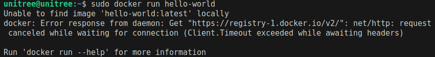
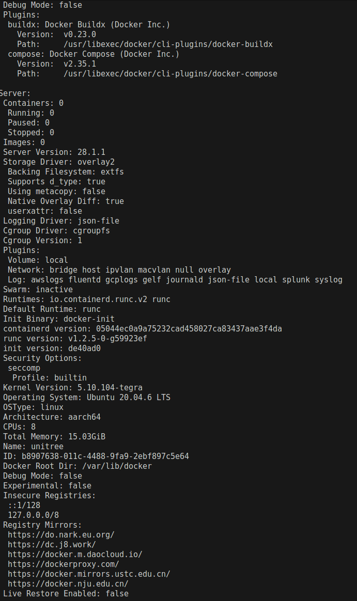
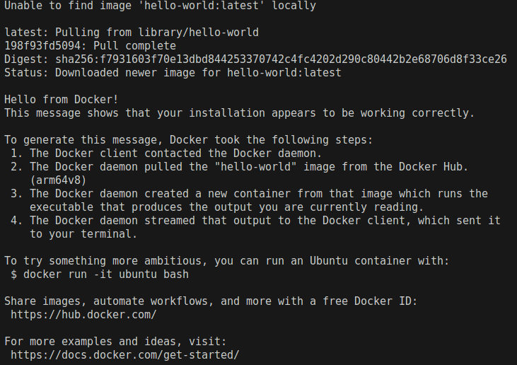

Docker运行hello-world镜像失败或超时
===


Docker运行hello-world镜像失败或超时，报错：
`Unable to find image ‘hello-world:latest’ locally`
`Trying to pull repository docker.io/library/hello-world …`
`/usr/bin/docker-current: missing signature key.`
`See ‘/usr/bin/docker-current run --help’.`
例如下面所示

<p align="center">
  
</p>

在安装 Docker 并尝试运行 hello-world 时，遇到连接超时的问题，这通常是因为默认的 Docker 镜像源访问速度较慢或不稳定所导致的。为了加速 Docker 镜像的下载和提升稳定性，解决这个问题的一种有效方法就是更换镜像源。

可以参考[官方文档（阿里云）](https://cr.console.aliyun.com/cn-shenzhen/instances/mirrors)解决步骤

---
## 准备：排除安装不到位的问题
详细的**Docker Engine**安装方法请看[官方文档](https://docs.docker.com/engine/install/ubuntu/#next-steps)，或者可以参考我给出的[安装方法](docker_install.md)（摘录官方文档）。


## 第一步：配置加速地址：设置registry mirror
```bash
sudo mkdir -p /etc/docker
sudo tee /etc/docker/daemon.json <<-'EOF'
{
    "registry-mirrors": [
        "https://do.nark.eu.org",
        "https://dc.j8.work",
        "https://docker.m.daocloud.io",
        "https://dockerproxy.com",
        "https://docker.mirrors.ustc.edu.cn",
        "https://docker.nju.edu.cn"
    ]
}
EOF
sudo systemctl daemon-reload
sudo systemctl restart docker
systemctl status docker
```
正确启动后如下列所示
```bash
systemctl status docker
● docker.service - Docker Application Container Engine
     Loaded: loaded (/lib/systemd/system/docker.service; enabled; vendor preset: enabled)
     Active: active (running) since Wed 2025-11-26 10:01:12 CST; 8s ago
TriggeredBy: ● docker.socket
       Docs: https://docs.docker.com
   Main PID: 15683 (dockerd)
      Tasks: 14
     Memory: 26.1M
     CGroup: /system.slice/docker.service
             └─15683 /usr/bin/dockerd -H fd:// --containerd=/run/containerd/containerd.sock

Nov 26 10:01:12 unitree dockerd[15683]: time="2025-11-26T10:01:12.568188008+08:00" level=info msg="[gr>
Nov 26 10:01:12 unitree dockerd[15683]: time="2025-11-26T10:01:12.571238811+08:00" level=info msg="Loa>
Nov 26 10:01:12 unitree dockerd[15683]: time="2025-11-26T10:01:12.807182714+08:00" level=warning msg=">
Nov 26 10:01:12 unitree dockerd[15683]: time="2025-11-26T10:01:12.853438999+08:00" level=info msg="Loa>
Nov 26 10:01:12 unitree dockerd[15683]: time="2025-11-26T10:01:12.869045529+08:00" level=info msg="Doc>
Nov 26 10:01:12 unitree dockerd[15683]: time="2025-11-26T10:01:12.869234940+08:00" level=info msg="Ini>
Nov 26 10:01:12 unitree dockerd[15683]: time="2025-11-26T10:01:12.893114087+08:00" level=info msg="Com>
Nov 26 10:01:12 unitree dockerd[15683]: time="2025-11-26T10:01:12.907640791+08:00" level=info msg="Dae>
Nov 26 10:01:12 unitree dockerd[15683]: time="2025-11-26T10:01:12.907805498+08:00" level=info msg="API>
Nov 26 10:01:12 unitree systemd[1]: Started Docker Application Container Engine.
```
启动失败如下列所示
```bash
sudo systemctl status docker
● docker.service - Docker Application Container Engine
     Loaded: loaded (/lib/systemd/system/docker.service; enabled; vendor preset: enabled)
     Active: failed (Result: exit-code) since Wed 2025-11-26 09:38:31 CST; 5s ago
TriggeredBy: ● docker.socket
       Docs: https://docs.docker.com
    Process: 10101 ExecStart=/usr/bin/dockerd -H fd:// --containerd=/run/containerd/containerd.sock (code=exited, status=1/FAILURE)
   Main PID: 10101 (code=exited, status=1/FAILURE)

Nov 26 09:38:31 unitree systemd[1]: docker.service: Scheduled restart job, restart counter is at 4.
Nov 26 09:38:31 unitree systemd[1]: Stopped Docker Application Container Engine.
Nov 26 09:38:31 unitree systemd[1]: docker.service: Start request repeated too quickly.
Nov 26 09:38:31 unitree systemd[1]: docker.service: Failed with result 'exit-code'.
Nov 26 09:38:31 unitree systemd[1]: Failed to start Docker Application Container Engine.
```


## 第二步：重启完docker之后检查registry mirror刚刚配置的加速地址是否成功
```bash
docker info
```
输出如下：
<p align="center">
  
</p>

其中
```bash
Registry Mirrors:
  https://do.nark.eu.org/
  https://dc.j8.work/
  https://docker.m.daocloud.io/
  https://dockerproxy.com/
  https://docker.mirrors.ustc.edu.cn/
  https://docker.nju.edu.cn/
```
这里出现了Registy Mirrors。说明通过上面的命令已经配置成功。

如果没有正确输出，请添加用户组并且重启
将当前用户添加到docker组：
```bash
sudo usermod -aG docker $USER
```
>或者明确指定用户名
>```bash
>sudo usermod -aG docker unitree
>```

使用`newgrp`命令立即生效（或登出再登录重启）：
```bash
newgrp docker
```

## 第三步：运行docker run hello-world

```bash
docker run hello-world
```
运行成功如下图所示

<p align="center">
  
</p>

此时我们也可以查看是否成功拉取hello-world镜像：
```bash
docker images
REPOSITORY    TAG       IMAGE ID       CREATED        SIZE
hello-world   latest    ca9905c726f0   3 months ago   5.2kB
```

---
[**返回主目录**](/README.md)
---