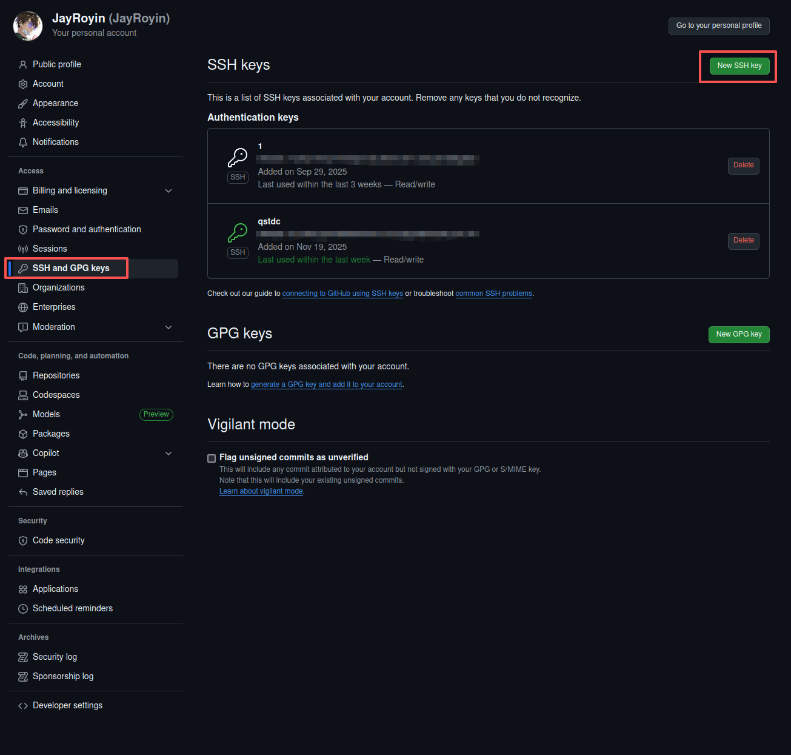

GitHub Ubuntu 上传文件指南：从本地到远程仓库的简易步骤解析
===

本文将详细介绍在Ubuntu操作系统上如何使用GitHub上传文件，涵盖从本地仓库到远程仓库的完整流程。我们将使用Git命令行工具，逐步指导您完成每一步操作。

**前提条件**
- **Ubuntu操作系统：** 确保您的机器上安装了Ubuntu。
- **Git安装：**  Git是版本控制系统，用于跟踪文件的更改。
- **GitHub账号：** 需要一个GitHub账号，用于托管远程仓库。

**步骤 1：安装Git**

在Ubuntu上安装Git非常简单，只需打开终端并运行以下命令：
```bash
sudo apt update
sudo apt install git
```
这些命令将更新包列表并安装Git。
**步骤 2：配置Git**

安装Git后，您需要配置用户名和邮箱，这样GitHub可以识别您的提交。
```bash
git config --global user.name "您的用户名"
git config --global user.email "您的邮箱"
```
请将“您的用户名”和“您的邮箱”替换为您的GitHub用户名和邮箱。
**步骤 3：创建SSH密钥**

为了安全地连接到GitHub，您需要生成一个SSH密钥对，并将公钥添加到GitHub。
```bash
ssh-keygen -t rsa -b 4096 -C "您的邮箱"

# 或者
ssh-keygen
# 输入之后一直回车就好，在这里插入图片描述出现这个画面就是成功了
```

在执行此命令时，系统会提示您输入文件保存位置和密码，可以按默认设置直接回车跳过。
**步骤 4：将SSH公钥添加到GitHub**

打开GitHub网站，登录您的账号,
点击右上角的头像，选择“Settings”,
在左侧菜单中选择“SSH and GPG keys”,
点击“New SSH key”。



在“Key”文本框中，粘贴您的SSH公钥。您可以通过以下命令查看公钥：
```bash
cat ~/.ssh/id_rsa.pub
```
点击“Add SSH key”。

>按Ctrl + H显示ubuntu的隐藏文件,找到 .ssh

**步骤 5：创建本地仓库**

在Ubuntu上，导航到您想要上传文件的目录，然后初始化一个Git仓库。
```bash
cd /path/to/your/project
git init
```

初始化成功如下：
```bash
提示：使用 'master' 作为初始分支的名称。这个默认分支名称可能会更改。要在新仓库中
提示：配置使用初始分支名，并消除这条警告，请执行：
提示：
提示：	git config --global init.defaultBranch <名称>
提示：
提示：除了 'master' 之外，通常选定的名字有 'main'、'trunk' 和 'development'。
提示：可以通过以下命令重命名刚创建的分支：
提示：
提示：	git branch -m <name>
已初始化空的 Git 仓库于 /***/.git/
```

这将创建一个新的本地Git仓库。
**步骤 6：添加文件到仓库**

将您想要上传的文件添加到Git仓库。
```bash
git add .
```
这个命令会将所有修改过的文件添加到暂存区。
**步骤 7：提交更改**

提交您添加的文件。
```bash
git commit -m "您的提交信息"
```
请将“您的提交信息”替换为描述您更改的简短信息。
**步骤 8：关联远程仓库**

在GitHub上创建一个新的远程仓库，然后将本地仓库与之关联。
```bash
git remote add origin git@github.com:yourusername/your-repository.git
```
请将`yourusername/your-repository`替换为您的GitHub用户名和仓库名。
**步骤 9：上传到远程仓库**

最后，将您的本地更改推送到远程仓库。
```bash
git push -u origin master
```
如果您的分支名不是`master`，请替换为您的分支名。
