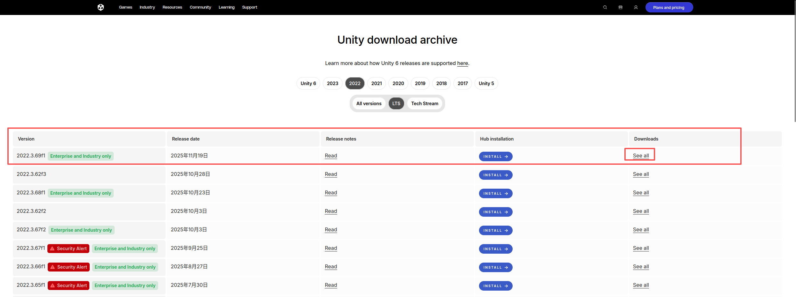
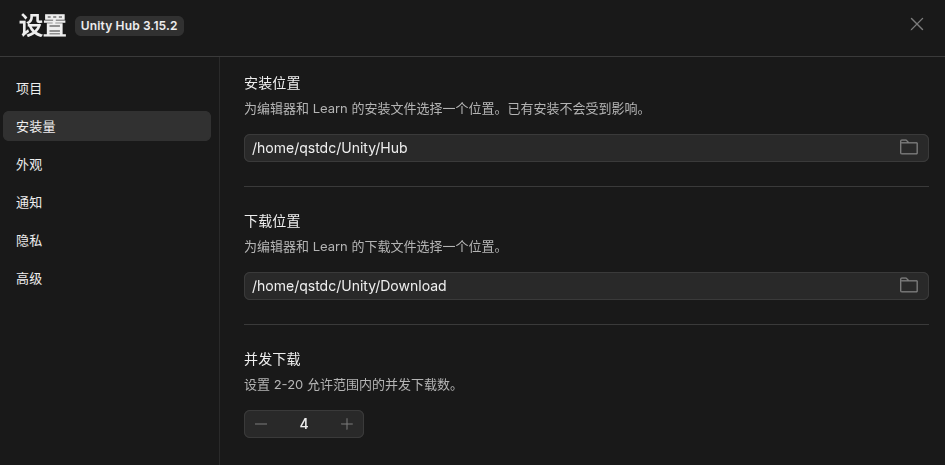

UnityHub安装相关
===
- [UnityHub安装相关](#unityhub安装相关)
- [安装UnityHub for Linux](#安装unityhub-for-linux)
  - [系统要求](#系统要求)
  - [使用安装程序](#使用安装程序)
  - [安装旧版本的 Unity Hub](#安装旧版本的-unity-hub)
  - [在 Linux 上安装 Unity Hub](#在-linux-上安装-unity-hub)
  - [Red Hat Enterprise Linux (RHEL) 或 CentOS](#red-hat-enterprise-linux-rhel-或-centos)
- [Unity 相关问题](#unity-相关问题)
  - [用Unity Hub下载编辑器失败(2022.3.69f1)](#用unity-hub下载编辑器失败2022369f1)

# 安装UnityHub for Linux

## 系统要求

Unity Hub 支持以下操作系统：

- Windows：10（21H1 及更高版本，64 位版本），11
- macOS：12 及更高版本
- Linux：Ubuntu 22.04、24.04

>注意： Unity 支持 Apple Silicon 设备（M1 设备），您可以通过 Unity Hub 安装 Apple Silicon Unity 编辑器。更多信息，请访问 “安装 Apple Silicon 编辑器” 论坛页面。此外，Unity 在 2023.1 版本之后将不再支持 Windows 7。Unity 建议您升级到受支持的操作系统以使用 2023.1 版本。
## 使用安装程序

要安装 Unity Hub，请执行以下操作：

- **1.** 前往 Unity 官网的 Unity 下载页面。
- **2.** 选择下载 Unity Hub 。
- **3.** 打开安装程序文件。
- **4.** 请按照 Unity Hub 设置窗口中的说明进行操作。

首次安装 Unity Hub 时，Unity Hub 将运行并打开欢迎页面。要使用 Hub，请使用您的 Unity ID 登录 。如果您没有 Unity 帐户，请选择 “**创建 Unity ID**” 来创建一个新帐户 。

>注意 ：首次启动 Unity Hub 时，它可能会请求访问您文件系统中的某些位置或通过防火墙连接。Hub 使用这些权限来访问您的本地项目文件、编辑器安装以及从云服务器获取资源。
## 安装旧版本的 Unity Hub

如果出于兼容性原因需要使用旧版本的 Hub，您可以为您的平台下载以下版本之一：
**Unity Hub 3.14.4**(Ubuntu 版本 24.04)
  [RPM 软件包](https://public-cdn.cloud.unity3d.com/hub/3.14.4/unityhub-x86_64-3.14.4.rpm)
  [DEB 软件包](https://public-cdn.cloud.unity3d.com/hub/3.14.4/unityhub-amd64-3.14.4.deb)

**Unity Hub 3.12.1**(Ubuntu 版本 20.04 和 22.04)

  [RPM 软件包](https://public-cdn.cloud.unity3d.com/hub/3.12.0/unityhub-x86_64-3.12.1.rpm)
  [DEB 软件包](https://public-cdn.cloud.unity3d.com/hub/3.12.0/unityhub-amd64-3.12.1.deb)

>注意： 请使用最新版本的 Unity Hub 以确保最佳性能、访问最新功能、接收安全更新并保持与最新 Unity 编辑器版本的兼容性。

## 在 Linux 上安装 Unity Hub
Debian 或 Ubuntu

要在 Debian 或 Ubuntu Linux 发行版上安装 Unity Hub，您需要添加 Unity Hub Debian 存储库以及公钥以验证软件包的完整性。

要添加公钥，请运行以下命令：
```bash
wget -qO - https://hub.unity3d.com/linux/keys/public | gpg --dearmor | sudo tee /usr/share/keyrings/Unity_Technologies_ApS.gpg > /dev/null
```
要添加 Unity Hub 软件源，需要在 `/etc/apt/sources.list.d` 中添加一个条目。运行以下命令添加 Unity Hub 软件源：
```bash
sudo sh -c 'echo "deb [signed-by=/usr/share/keyrings/Unity_Technologies_ApS.gpg] https://hub.unity3d.com/linux/repos/deb stable main" > /etc/apt/sources.list.d/unityhub.list'
```
更新软件包缓存并安装软件包：
```bash
sudo apt update
sudo apt-get install unityhub
```

>注意：对于某些系统，您可能需要确保以下事项：
>
>目录 `/usr/share/keyrings` 存在。
>安装 Hub 的用户或组对 `/usr/share/keyrings` 目录具有写入权限。
>安装 Hub 的用户或组至少拥有对生成的 **Unity_Technologies_ApS.gpg** 文件的读取权限。

要从系统中移除 Unity Hub，请运行以下命令：
```bash
sudo apt-get remove unityhub
```
## Red Hat Enterprise Linux (RHEL) 或 CentOS

要在 RHEL 或 CentOS Linux 发行版上安装 Unity Hub，您需要将 `Unity Hub rpm` 存储库添加到您的已知存储库列表中。

要添加 Unity Hub 软件仓库，需要在 `/etc/yum.repos.d/` 目录下添加一个条目。运行以下命令添加 Unity Hub 软件仓库：
```bash
sudo sh -c 'echo -e "[unityhub]\nname=Unity Hub\nbaseurl=https://hub.unity3d.com/linux/repos/rpm/stable\nenabled=1\ngpgcheck=1\ngpgkey=https://hub.unity3d.com/linux/repos/rpm/stable/repodata/repomd.xml.key\nrepo_gpgcheck=1" > /etc/yum.repos.d/unityhub.repo'
```
更新软件包缓存并使用以下命令安装软件包：
```bash
sudo yum check-update
sudo yum install unityhub
```
要从系统中移除 Unity Hub，请运行以下命令：
```bash
sudo yum remove unityhub
```
***

# Unity 相关问题
## 用Unity Hub下载编辑器失败(2022.3.69f1)
用Unity Hub下载编辑器出现`下载失败: Validation Failed`的问题，如图所示：

<p align="center">
  
</p>

我们可以去[官网Unity编辑器](https://unity.com/releases/editor/archive)进行手动下载，进入页面选择需要的编辑器版本，点击**see more**，进入下载页面，这里以[2022.3.69f1](https://unity.com/releases/editor/whats-new/2022.3.69f1#installs)为例,选择自己适合的系统版本进行下载。

<p align="center">
  
</p>

点击[2022.3.69f1](https://download.unity3d.com/download_unity/621633b9d04b/LinuxEditorInstaller/Unity-2022.3.69f1.tar.xz)可以直接下载，可以去下载目录直接解压出Editor的文件夹，或者在下载目录使用我的指令进行操作

```bash
# 1. 创建顶层Unity目录（如果它不存在）
mkdir -p ~/Unity

# 2. 在Unity目录下创建子目录结构
mkdir -p ~/Unity/{Download,Hub/Editor}

# 3. 移动压缩包到新的Download目录
mv ~/下载/Unity-2022.3.69f1.tar.xz ~/Unity/Download/

# 4. 进入Download目录以便于接下来的操作
cd ~/Unity/Download/

# 5. 定义解压后的目标目录名和完整路径
TARGET_DIR_NAME="2022.3.69f1"
TARGET_PATH=~/Unity/Hub/Editor/$TARGET_DIR_NAME

# 6. 创建目标解压目录
mkdir -p "$TARGET_PATH"

# 7. 解压文件到目标目录
# -x: 解压
# -v: 显示详细过程 (可选)
# -f: 指定压缩文件
# -C: 切换到指定目录解压
tar -xvf Unity-2022.3.69f1.tar.xz -C "$TARGET_PATH"

```
创建成功后的目录如下
```bash
Unity
├── Download
│   ├── Unity-2022.3.69f1.tar.xz（待解压文件）
│   └── zh-hans.po 
└── Editor
    └── 2022.3.69f1
        └── Editor
            ├── BugReporter
            ├── Data
            ├── etccompress.so
            ├── libcompress_bc7e.so
            ├── libembree.so
            ├── libfbxsdk.so
            ├── libfreeimage-3.18.0.so
            ├── libispc_texcomp.so
            ├── libRadeonRays.so
            ├── libRadeonRays.so.2.0
            ├── libre2.so
            ├── libre2.so.0
            ├── libRL.so
            ├── libtbbmalloc.so.2
            ├── libtbb.so.2
            ├── libumbraoptimizer64.so
            ├── s3tcompress.so
            ├── Unity（目标文件）
            └── Unity_s.debug
```

进入Unity Hub，定位解压后的文件`Unity/Hub/Editor/2022.3.69f1/Editor/Unity`，定位成功后，可以尝试新建项目，如果有模板显示，则安装成功，如图所示：
<p align="center">
  
</p>

如果没有显示模板信息或者说网络问题，则请注意目录是否有问题。

同时可以修改Unity的设置中的安装位置，如下图所示：
<p align="center">
  
</p>
